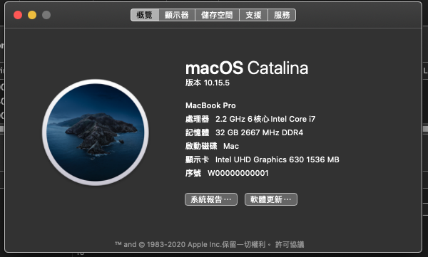
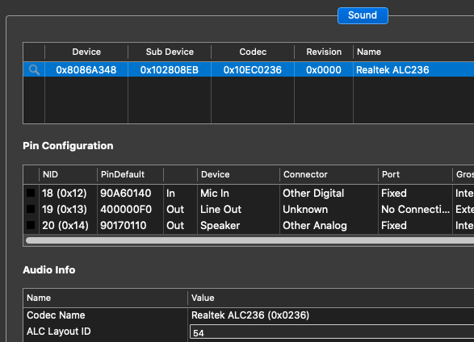

# Dell-G7-7590-Hackintosh-OpenCore
This EFI only for G7-7590

	

Base On [tctien342/Dell-Inspiron-7591-Hackintosh](https://github.com/tctien342/Dell-Inspiron-7591-Hackintosh/)

## System configuration

| Model     | MacBookPro16,1      | Version        | BigSur 11 Beta      |
| :-------- | :------------------ | :------------- | :------------------ |
| Processor | Intel Core i7-8750H | Graphics       | UHD Graphics 630    |
| Memory    | 2667MHz DDR4 2x16GB | OS Disk        | TOPMORE TPCIE500-0G |
| Audio     | Realtek ALC263      | WiFi           | TP-Link T3U         |
| Display   | 1080P               |                |                     |

#### Not Working

- Thing may never work/不能使用項目:
    - Discrete GPU (Disabled)/獨立顯卡
    - HDMI port(Type-C is Working well)
    - Intel Wifi/Bluetooth

## Different then other

	

- ALC236
    - Other 7500 series always using ALC295, must using Hackintool to check it
    - 其他的7500系列用的是 ALC295 layoutId 77的，G7 7590要Layout Id 54

- Microphone is Working Well/內建麥克風正常

## Credits

- [acidanthera](https://github.com/acidanthera) for providing almost all kexts and drivers
- [headkaze](https://github.com/headkaze) for providing the very useful [Hackintool](https://www.tonymacx86.com/threads/release-hackintool-v2-8-6.254559/)
- [Pinming](https://github.com/Pinming/Dell-Inspiron-7590-Hackintosh-Opencore)
- [黑果小兵的部落阁](https://blog.daliansky.net/)